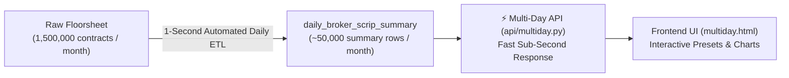

# 📖 The Master Guide to NEPSE Multi-Day Historical Flow Analytics

> *A comprehensive, beginner-friendly manual explaining every metric, chart, and feature in the institutional NEPSE Multi-Day Analytics Suite.*

---

## 🌟 1. Introduction & The Multi-Day Advantage

While **Raw Floorsheet** (`index.html`), **Broker Analytics** (`visual.html`), and **Scrip Analytics** (`script.html`) provide deep single-session intraday analysis, **Multi-Day Flow Analytics** (`multiday.html`) provides the **macro horizon**.

It answers long-term institutional questions:
- Which brokers are **persistently accumulating** a stock over **5, 10, or 20 trading days** (not just one random day)?
- What is the true **Volume-Weighted Average Acquisition Price (Multi-Day VWAP)** for institutional buyers over a whole week or month?
- How is institutional capital distributed across the entire broker universe over time?
- Which stocks are seeing steady, continuous multi-day net capital inflows?

---

## ⚡ 2. The 97% Data Reduction Engine (`daily_broker_scrip_summary`)

To prevent multi-second lag when querying 1 month of raw trading data (over **1.5 Million raw trade contracts**), the platform utilizes an automated, pre-aggregated CockroachDB analytical layer:

- **Reconciliation Check**: Every evening at 17:00 NPT, the ETL automatically verifies that:
  $$\sum \text{Raw Quantity} = \sum \text{Summary Buy Quantity} = \sum \text{Summary Sell Quantity}$$
  $$\sum \text{Raw Amount} = \sum \text{Summary Buy Amount} = \sum \text{Summary Sell Amount}$$
- Audit records are stored in `analytics_etl_runs`.

---

## 🧭 3. Global Navigation Across All 4 Views

- **`📄 Raw Floorsheet` (`index.html`)**: Tick-by-tick individual trade contracts.
- **`🏢 Broker Analytics` (`visual.html`)**: Single-day broker market share & intraday velocity.
- **`📊 Scrip Analytics` (`script.html`)**: Single-day stock VWAP, counterparty routes & whale scanner.
- **`🔄 Multi-Day Flow` (`multiday.html`)**: Multi-day historical broker & scrip accumulation trajectories across 3D, 5D, 10D, 20D, and custom windows.

---

## 🧮 4. Core Multi-Day Metrics & Formulas

### 4.1. Mathematically Correct Multi-Day VWAP
> ⚠️ **Financial Standard**: Multi-day VWAP is **never** calculated as the simple average of daily VWAPs. It is calculated by dividing total turnover by total volume:
$$\text{Multi-Day Buy VWAP} = \frac{\sum_{i=1}^N \text{Buy Turnover}_i}{\sum_{i=1}^N \text{Buy Quantity}_i}$$
$$\text{Multi-Day Sell VWAP} = \frac{\sum_{i=1}^N \text{Sell Turnover}_i}{\sum_{i=1}^N \text{Sell Quantity}_i}$$

### 4.2. Buy Persistence %
- **Definition**: The percentage of trading sessions within the selected window where the broker was a **Net Buyer** ($\text{Buy Amount} > \text{Sell Amount}$).
- **Formula**:
  $$\text{Buy Persistence \%} = \left(\frac{\text{Positive Net Flow Days}}{\text{Total Trading Sessions in Period}}\right) \times 100$$
- **Interpretation**:
  - **$\ge 80\%$**: High conviction, persistent institutional accumulation.
  - **$\approx 50\%$**: Balanced 2-way market-making or swing trading.
  - **$< 20\%$**: Persistent net seller / distribution.

### 4.3. Trading-Session Aware Windows
- Unlike calendar days that include weekends and holidays, the presets **`3D`**, **`5D`**, **`10D`**, and **`20D`** dynamically count **actual open NEPSE trading sessions**, guaranteeing that 5D represents a true full 5-session trading week.

---

## 📊 5. Master Multi-Day Matrices

### 5.1. Multi-Day Broker Matrix
- **Gross Activity**: Total money handled ($\text{Buy Turnover} + \text{Sell Turnover}$).
- **Net Flow Value**: Net capital added or removed ($\text{Buy Turnover} - \text{Sell Turnover}$).
- **Buy VWAP vs Sell VWAP**: Multi-day volume-weighted execution benchmarks.
- **Positive Days**: Count of winning accumulation sessions.
- **Market Share %**: Percentage of entire market turnover executed by this broker.

### 5.2. Multi-Day Scrip Matrix
- **Turnover & Volume**: Total liquidity over the period.
- **Multi-Day VWAP**: True institutional acquisition cost.
- **Top Net Buyer & Seller Brokers**: Identifies which brokers accumulated the most shares over the multi-day period.
- **Top 3 Buyer Share %**: Institutional concentration over time.

---

## 🔬 6. Multi-Day Deep Drilldown Drawers

Clicking on any Broker or Stock opens the dedicated multi-day drilldown drawer:

1. **Executive KPI Row**: Gross, Net Flow, Weighted VWAP, and Active scope.
2. **Chart.js Day-by-Day Capital Trajectory**:
   - **Broker View**: Green Buy bars, Red Sell bars, and Blue Net Flow trend line.
   - **Scrip View**: Blue Daily Turnover bars and Orange Daily VWAP curve.
3. **Multi-Day Traded Roster**: Complete sortable portfolio with persistence indicators.

---

*Authored by **Your Zara** and **Jagdish Sah** for the NEPSE community.*
