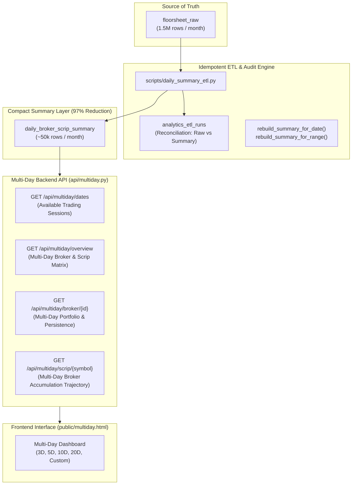

# 📋 Master Production Specification: NEPSE Multi-Day Broker & Scrip Flow Analytics

> **Document Type:** Production Engineering & Analytical Specification  
> **Status:** 🎯 FINALIZED & READY FOR IMPLEMENTATION  
> **Target Modules:**  
> - Database: `daily_broker_scrip_summary`, `analytics_etl_runs`  
> - Backend Service: `api/multiday.py`  
> - Ingestion / ETL Engine: `scripts/daily_summary_etl.py`  
> - Frontend Interface: `public/multiday.html`, `public/multiday.js`  
> - Master Docs: `Explain_multiday.md`, `README.md`  
> **Authors:** Your Zara & Jagdish Sah  
> **Date:** September 2026  

---

## 🌟 1. System Architecture & The 97% Data Reduction

When querying multi-day trading windows (e.g., **20 trading days / 1 month**), querying the raw `floorsheet_raw` table forces the database to scan over **1.2 to 1.5 Million transaction contracts**, causing CPU spikes and Vercel serverless execution timeouts.

To guarantee high-throughput, low-latency analytics across months and years of data, the system introduces a **Pre-Aggregated Daily Summary Layer** (`daily_broker_scrip_summary`) stored in CockroachDB:



---

## 🗄️ 2. Database Schema Design

### 2.1. Derived Table: `daily_broker_scrip_summary`
```sql
CREATE TABLE IF NOT EXISTS daily_broker_scrip_summary (
    trade_date DATE NOT NULL,
    broker_id INT2 NOT NULL,
    symbol VARCHAR(20) NOT NULL,

    buy_qty BIGINT NOT NULL DEFAULT 0,
    sell_qty BIGINT NOT NULL DEFAULT 0,
    net_qty BIGINT NOT NULL DEFAULT 0,

    buy_amt DECIMAL(18,2) NOT NULL DEFAULT 0,
    sell_amt DECIMAL(18,2) NOT NULL DEFAULT 0,
    net_amt DECIMAL(18,2) NOT NULL DEFAULT 0,

    trades_count INT NOT NULL DEFAULT 0, -- Total participation ticket count

    buy_vwap DECIMAL(12,4),
    sell_vwap DECIMAL(12,4),

    first_trade_time TIMESTAMP,
    last_trade_time TIMESTAMP,
    updated_at TIMESTAMP NOT NULL DEFAULT now(),

    PRIMARY KEY (trade_date ASC, broker_id ASC, symbol ASC),
    INDEX idx_summary_symbol_date (symbol ASC, trade_date ASC),
    INDEX idx_summary_broker_date (broker_id ASC, trade_date ASC),
    INDEX idx_summary_date (trade_date DESC)
);
```

### 2.2. ETL Audit & Integrity Log: `analytics_etl_runs`
```sql
CREATE TABLE IF NOT EXISTS analytics_etl_runs (
    run_id UUID PRIMARY KEY DEFAULT gen_random_uuid(),
    trade_date DATE NOT NULL UNIQUE,
    started_at TIMESTAMP NOT NULL DEFAULT now(),
    completed_at TIMESTAMP,
    status VARCHAR(20) NOT NULL DEFAULT 'PENDING', -- PENDING, SUCCESS, MISMATCH, FAILED
    raw_trades_count INT NOT NULL DEFAULT 0,
    summary_rows_count INT NOT NULL DEFAULT 0,
    raw_buy_qty BIGINT NOT NULL DEFAULT 0,
    summary_buy_qty BIGINT NOT NULL DEFAULT 0,
    raw_buy_amt DECIMAL(18,2) NOT NULL DEFAULT 0,
    summary_buy_amt DECIMAL(18,2) NOT NULL DEFAULT 0,
    reconciliation_matched BOOLEAN NOT NULL DEFAULT false,
    duration_ms INT,
    error_message TEXT
);
```

---

## 🔄 3. Idempotent ETL Engine & Reconciliation Protocol

### 3.1. Atomic Daily Aggregation
For any trading date `trade_date`, the ETL performs an idempotent upsert:
```sql
INSERT INTO daily_broker_scrip_summary (
    trade_date, broker_id, symbol, buy_qty, sell_qty, net_qty, buy_amt, sell_amt, net_amt,
    trades_count, buy_vwap, sell_vwap, first_trade_time, last_trade_time, updated_at
)
SELECT 
    trade_time::date AS trade_date,
    broker_id,
    symbol,
    SUM(buy_qty) AS buy_qty,
    SUM(sell_qty) AS sell_qty,
    SUM(buy_qty) - SUM(sell_qty) AS net_qty,
    SUM(buy_amt) AS buy_amt,
    SUM(sell_amt) AS sell_amt,
    SUM(buy_amt) - SUM(sell_amt) AS net_amt,
    COUNT(*) AS trades_count,
    ROUND(SUM(buy_amt) / NULLIF(SUM(buy_qty), 0), 4) AS buy_vwap,
    ROUND(SUM(sell_amt) / NULLIF(SUM(sell_qty), 0), 4) AS sell_vwap,
    MIN(trade_time) AS first_trade_time,
    MAX(trade_time) AS last_trade_time,
    now() AS updated_at
FROM (
    SELECT trade_time, buyer_broker AS broker_id, symbol, quantity AS buy_qty, 0::bigint AS sell_qty, amount AS buy_amt, 0::numeric AS sell_amt FROM floorsheet_raw WHERE trade_time::date = %s
    UNION ALL
    SELECT trade_time, seller_broker AS broker_id, symbol, 0::bigint AS buy_qty, quantity AS sell_qty, 0::numeric AS buy_amt, amount AS sell_amt FROM floorsheet_raw WHERE trade_time::date = %s
) flows
GROUP BY trade_date, broker_id, symbol
ON CONFLICT (trade_date, broker_id, symbol) DO UPDATE SET
    buy_qty = EXCLUDED.buy_qty,
    sell_qty = EXCLUDED.sell_qty,
    net_qty = EXCLUDED.net_qty,
    buy_amt = EXCLUDED.buy_amt,
    sell_amt = EXCLUDED.sell_amt,
    net_amt = EXCLUDED.net_amt,
    trades_count = EXCLUDED.trades_count,
    buy_vwap = EXCLUDED.buy_vwap,
    sell_vwap = EXCLUDED.sell_vwap,
    first_trade_time = EXCLUDED.first_trade_time,
    last_trade_time = EXCLUDED.last_trade_time,
    updated_at = now();
```

### 3.2. Mandatory Automated Reconciliation Check
Immediately after aggregation:
$$\text{Reconciliation Check}: \begin{cases} \sum \text{Raw Quantity} = \sum \text{Summary Buy Quantity} = \sum \text{Summary Sell Quantity} \\ \sum \text{Raw Amount} = \sum \text{Summary Buy Amount} = \sum \text{Summary Sell Amount} \end{cases}$$
If any deviation $> 0.01$, the ETL run status is flagged as `MISMATCH` and logged in `analytics_etl_runs`.

---

## 🧮 4. Core Analytical Formulas & Strict Math

### 4.1. Mathematically Correct Multi-Day VWAP
> ⚠️ **Critical Financial Rule**: Multi-day VWAP must **never** be calculated as the simple average of daily VWAPs ($\frac{1}{N} \sum \text{VWAP}_i$). It must always be calculated as:
$$\text{Multi-Day Buy VWAP} = \frac{\sum_{i=1}^N \text{buy\_amt}_i}{\sum_{i=1}^N \text{buy\_qty}_i}$$
$$\text{Multi-Day Sell VWAP} = \frac{\sum_{i=1}^N \text{sell\_amt}_i}{\sum_{i=1}^N \text{sell\_qty}_i}$$

### 4.2. Broker Flow Persistence & Streak Metrics
For a broker in a stock over $N$ trading sessions:
- **Positive Flow Days ($D^+$)**: Count of days where $\text{net\_amt} > 0$.
- **Negative Flow Days ($D^-$)**: Count of days where $\text{net\_amt} < 0$.
- **Buy Persistence %**:
  $$\text{Buy Persistence} = \left(\frac{D^+}{N}\right) \times 100$$
- **Longest Accumulation Streak**: Maximum consecutive trading sessions where $\text{net\_amt} > 0$.

### 4.3. Market Share & Context-Adjusted Flow
- **Broker Buy Market Share %**:
  $$\text{Share \%} = \frac{\sum \text{Broker Buy Amount}}{\sum \text{Stock Total Turnover}} \times 100$$

---

## 🚀 5. Multi-Day Backend API Specification (`api/multiday.py`)

### 5.1. `GET /api/multiday/dates`
Returns all available trading dates and session counts in descending order.

### 5.2. `GET /api/multiday/overview`
- **Query Parameters**:
  - `preset`: `3D`, `5D`, `10D`, `20D`, or `custom`
  - `start_date`, `end_date`: `YYYY-MM-DD`
  - `min_turnover`: float
  - `limit`: int (default `50`, max `200`)
- **Returns**:
  - `period_metadata`: `start_date`, `end_date`, `trading_sessions_count`, `latest_data_freshness`
  - `macro_summary`: Total Market Turnover, Total Volume, Total Trades
  - `broker_leaderboard`: Ranked brokers with Multi-Day Gross, Net Flow, Buy/Sell VWAP, Persistence
  - `scrip_leaderboard`: Ranked stocks with Multi-Day Turnover, Volume, Top Net Buyer Broker, Top Net Seller Broker, Multi-Day VWAP

### 5.3. `GET /api/multiday/broker/{id}`
- **Returns**:
  - Multi-day portfolio breakdown of all traded scrips for Broker `{id}`.
  - Daily flow timeline (Day-by-day Buy, Sell, and Net Flow trajectory).
  - Persistence scores and longest buying/selling streaks.

### 5.4. `GET /api/multiday/scrip/{symbol}`
- **Returns**:
  - Multi-day broker participation matrix for `{symbol}`.
  - Day-by-day price trajectory vs broker accumulation.
  - Top persistent accumulator brokers.

---

## 🖥️ 6. Frontend Interface: `public/multiday.html` & `public/multiday.js`

### 6.1. 4-Tab Navigation Integration
Update master navigation bar across all HTML files:
```html
<nav class="nav-tabs">
  <a href="index.html" class="nav-tab">📄 Raw Floorsheet</a>
  <a href="visual.html" class="nav-tab">🏢 Broker Analytics</a>
  <a href="script.html" class="nav-tab">📊 Scrip Analytics</a>
  <a href="multiday.html" class="nav-tab active">🔄 Multi-Day Flow</a>
</nav>
```

### 6.2. Interactive Controls
- **Date Preset Selector**: `[ 3 Days ]`, `[ 5 Days (1W) ]`, `[ 10 Days (2W) ]`, `[ 20 Days (1M) ]`, `[ Custom Range ]`.
- **Trading Session Counter**: Badges showing e.g. `Trading Sessions: 20 days · Validated ✅`.
- **Dual Leaderboards**:
  - Multi-Day Broker Matrix (Sortable by Net Flow, Gross, Persistence, Market Share).
  - Multi-Day Scrip Matrix (Sortable by Turnover, Multi-Day VWAP, Top Accumulators).
- **Drilldown Modal Drawers**:
  - Broker multi-day daily timeline chart (Chart.js bar/line).
  - Scrip multi-day broker roster with streak indicators.
  - CSV Export.

---

## 📅 7. Execution Roadmap & Definition of Done

1. **Phase 1: Database Migration & Schema Setup**
   - Create `daily_broker_scrip_summary` and `analytics_etl_runs` tables in CockroachDB with indexes.
2. **Phase 2: ETL Engine & Historical Backfill Script**
   - Implement `scripts/daily_summary_etl.py` with `rebuild_for_date()` and `rebuild_for_range()`.
   - Run backfill across all 21 historical days currently in the database with automated reconciliation.
3. **Phase 3: Backend Service (`api/multiday.py`) & Vercel Routing**
   - Implement `/api/multiday/dates`, `/overview`, `/broker/{id}`, and `/scrip/{symbol}`.
   - Add route in `vercel.json`.
4. **Phase 4: Frontend Development (`public/multiday.html` & `public/multiday.js`)**
   - Build UI, Chart.js multi-day timelines, sortable tables, and 4-tab navigation links.
5. **Phase 5: Documentation & Git Commit**
   - Create `Explain_multiday.md`, update master `README.md`.
   - Git commit authored by `Your Zara` and pushed to GitHub.

---

*Authored by **Your Zara** and **Jagdish Sah**.*
