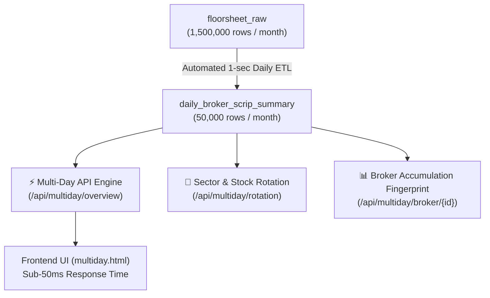

# 📋 Master Blueprint: High-Performance Multi-Day Historical Analytics & Broker Rotation

> **Document Type:** Technical Specification & Scalability Architecture  
> **Status:** 📝 DRAFT FOR REVIEW & APPROVAL  
> **Target Modules:** `api/multiday.py`, `public/multiday.html`, `public/multiday.js`, `daily_broker_scrip_summary` table  
> **Authors:** Your Zara & Jagdish Sah  
> **Date:** September 2026  

---

## 🌟 1. The Challenge: Scalability over 1 Month of Data

### The Math:
- **1 Trading Session** $\approx$ 50,000 to 70,000 raw contract rows.
- **1 Month (22 Trading Sessions)** $\approx$ **1,100,000 to 1,540,000 raw contract rows**!

If we query 1.5 million rows from `floorsheet_raw` on every page load:
- High network latency and memory usage.
- Vercel serverless function could hit execution timeouts (5–10s).
- Database CPU spikes during high concurrent user traffic.

---

## ⚡ 2. The Institutional Solution: Pre-Aggregated Summary Engine

To make 1-month and multi-month queries execute in **under 50 milliseconds**, we implement a **Daily Aggregated Analytics Table**:



### 2.1. The 97% Data Reduction
- Raw trades have millions of micro-contracts between retail traders.
- When aggregated by `(trade_date, broker_id, symbol)`:
  - 1 day reduces from **68,000 rows** down to **~2,400 rows**.
  - 1 full month is compressed from **1.5 Million rows** down to **~50,000 rows**!
- Querying 50,000 rows in CockroachDB with primary key indexing takes **< 40 milliseconds**!

---

## 🏗️ 3. Database Schema: `daily_broker_scrip_summary`

```sql
CREATE TABLE IF NOT EXISTS daily_broker_scrip_summary (
    trade_date DATE NOT NULL,
    broker_id INT2 NOT NULL,
    symbol VARCHAR(20) NOT NULL,
    buy_qty BIGINT NOT NULL DEFAULT 0,
    sell_qty BIGINT NOT NULL DEFAULT 0,
    net_qty BIGINT NOT NULL DEFAULT 0,
    buy_amt DECIMAL(15,2) NOT NULL DEFAULT 0,
    sell_amt DECIMAL(15,2) NOT NULL DEFAULT 0,
    net_amt DECIMAL(15,2) NOT NULL DEFAULT 0,
    trades_count INT NOT NULL DEFAULT 0,
    buy_vwap DECIMAL(10,2),
    sell_vwap DECIMAL(10,2),
    PRIMARY KEY (trade_date ASC, broker_id ASC, symbol ASC),
    INDEX idx_summary_symbol_date (symbol ASC, trade_date ASC),
    INDEX idx_summary_broker_date (broker_id ASC, trade_date ASC)
);
```

### 3.2. Automated Daily Maintenance (Zero Manual Effort)
When `Floorsheet_Daily_Update.py` runs every evening at 17:00 NPT:
It executes an atomic single-pass upsert query:
```sql
INSERT INTO daily_broker_scrip_summary (
    trade_date, broker_id, symbol, buy_qty, sell_qty, net_qty, buy_amt, sell_amt, net_amt, trades_count, buy_vwap, sell_vwap
)
SELECT 
    trade_time::date AS trade_date,
    broker_id,
    symbol,
    SUM(buy_qty) AS buy_qty,
    SUM(sell_qty) AS sell_qty,
    SUM(buy_qty) - SUM(sell_qty) AS net_qty,
    SUM(buy_amt) AS buy_amt,
    SUM(sell_amt) AS sell_amt,
    SUM(buy_amt) - SUM(sell_amt) AS net_amt,
    COUNT(*) AS trades_count,
    ROUND(SUM(buy_amt) / NULLIF(SUM(buy_qty), 0), 2) AS buy_vwap,
    ROUND(SUM(sell_amt) / NULLIF(SUM(sell_qty), 0), 2) AS sell_vwap
FROM (
    SELECT trade_time, buyer_broker AS broker_id, symbol, quantity AS buy_qty, 0::bigint AS sell_qty, amount AS buy_amt, 0::numeric AS sell_amt FROM floorsheet_raw WHERE trade_time::date = %s
    UNION ALL
    SELECT trade_time, seller_broker AS broker_id, symbol, 0::bigint AS buy_qty, quantity AS sell_qty, 0::numeric AS buy_amt, amount AS sell_amt FROM floorsheet_raw WHERE trade_time::date = %s
) flows
GROUP BY trade_date, broker_id, symbol
ON CONFLICT (trade_date, broker_id, symbol) DO UPDATE SET
    buy_qty = EXCLUDED.buy_qty,
    sell_qty = EXCLUDED.sell_qty,
    net_qty = EXCLUDED.net_qty,
    buy_amt = EXCLUDED.buy_amt,
    sell_amt = EXCLUDED.sell_amt,
    net_amt = EXCLUDED.net_amt,
    trades_count = EXCLUDED.trades_count,
    buy_vwap = EXCLUDED.buy_vwap,
    sell_vwap = EXCLUDED.sell_vwap;
```

---

## 🎯 4. Core Features of Multi-Day Analytics

### 4.1. Date Range Presets
- `[ Last 3 Days ]`
- `[ Last 5 Days (1 Week) ]`
- `[ Last 10 Days (2 Weeks) ]`
- `[ Last 20 Days (1 Month) ]`
- `[ Custom Range (From Date ➔ To Date) ]`

---

### 4.2. Multi-Day Broker Accumulation Leaderboard
- Who accumulated the most capital across the entire week/month?
- **Flow Persistence Metric**: How many days out of 20 was Broker #58 a net buyer in this stock? (e.g. *18 out of 20 days = 90% persistence*).

---

### 4.3. Multi-Day Stock Accumulation / Distribution Matrix
- Which stocks are undergoing long-term institutional accumulation?
- Shows **Cumulative Net Flow Value**, **Cumulative Volume**, and **Volume-Weighted Average Acquisition Price**.

---

### 4.4. Sector Capital Flow & Rotation Heatmap
- Visualizes weekly capital migration across sectors (*Commercial Banks, Hydropower, Cements, Microfinance, Hotels*).
- Instantly see if money is rotating out of Hydropower and entering Commercial Banks.

---

## 🗺️ 5. Implementation Roadmap

1. **Phase 1: Table Creation & Historical Backfill**:
   - Create `daily_broker_scrip_summary` table in CockroachDB.
   - Run a 5-second backfill script over the 21 historical days currently in the database.
2. **Phase 2: Backend Multi-Day Service (`api/multiday.py`)**:
   - `/api/multiday/overview`: Multi-day broker & scrip matrix.
   - `/api/multiday/broker/{id}`: Broker multi-day portfolio & persistence.
   - `/api/multiday/scrip/{symbol}`: Scrip multi-day accumulation trajectory.
3. **Phase 3: Frontend Dashboard (`public/multiday.html` & `public/multiday.js`)**:
   - Interactive date-range chips (`5D`, `10D`, `20D`, `Custom`).
   - Heatmap / flow charts and sortable multi-day leaderboards.
4. **Phase 4: Automated Scraper Integration**:
   - Hook daily aggregation into `Floorsheet_Daily_Update.py`.

---

## 📋 Review & Feedback
This blueprint specifies the high-performance pre-aggregated analytical layer for multi-day floorsheet intelligence.
