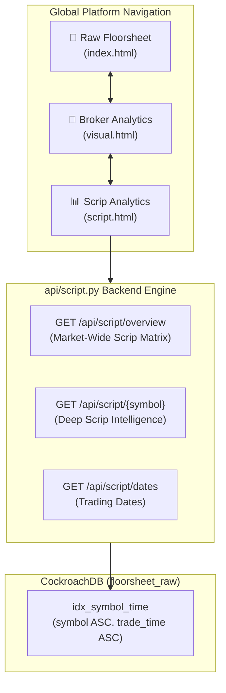

# 📋 Master Blueprint: NEPSE Scrip (Stock) Visual Analytics Suite (Finalized)

> **Document Type:** Technical Specification & Architectural Blueprint  
> **Status:** 🎯 FINALIZED & READY FOR IMPLEMENTATION  
> **Target Modules:** `api/script.py`, `public/script.html`, `public/script.js`, `public/styles.css`, `vercel.json`  
> **Authors:** Your Zara & Jagdish Sah  
> **Date:** September 2026  

---

## 🌟 1. Executive Summary & Vision

Following the deployment of the **Raw Floorsheet Browser** and the **Broker Visual Analytics Suite**, we are expanding the platform to introduce the third analytical pillar: **The Institutional Scrip (Stock) Analytics Suite**.



### 🎯 Core Purpose:
While Broker Analytics answers *"Where is a specific broker deploying capital across the market?"*, **Scrip Analytics** answers the stock-centric question:
> **"Who is participating in stock X (e.g. NABIL, SHIVM, SONA)? Which brokers are net buyers, which are net sellers, at what average execution prices (Buy VWAP vs Sell VWAP), what is the broker concentration, and when did large block trades occur?"**

---

## 🔬 2. Data Semantics, Precision & Integrity Standards

To maintain institutional credibility, the platform strictly separates **Observed Facts** from **Derived Analytics**:

### 2.1. Observed Facts (Mathematical Truths)
- **Turnover (NPR)**: Total value traded ($\sum \text{Amount}$).
- **Volume (Shares)**: Total shares traded ($\sum \text{Quantity}$).
- **Trades Count**: Number of executed contract records.
- **Intraday High / Low / LTP**: Highest, lowest, and last traded price of the session.
- **VWAP (Volume-Weighted Average Price)**:
  $$\text{VWAP} = \frac{\sum (\text{Quantity} \times \text{Rate})}{\sum \text{Quantity}}$$
- **Broker Buy & Sell VWAP**:
  $$\text{Buy VWAP} = \frac{\text{Buy Value}}{\text{Buy Qty}}, \quad \text{Sell VWAP} = \frac{\text{Sell Value}}{\text{Sell Qty}}$$

### 2.2. Derived Flow Analytics
- **Net Flow Quantity**: $\text{Buy Qty} - \text{Sell Qty}$
- **Net Flow Value**: $\text{Buy Value} - \text{Sell Value}$
- **Flow Bias (%)**:
  $$\text{Flow Bias \%} = \frac{\text{Buy Value} - \text{Sell Value}}{\text{Buy Value} + \text{Sell Value}} \times 100$$
- **Flow Badges**:
  - `🟢 NET BUYING`: Observed Buy Value $>$ Sell Value.
  - `🔴 NET SELLING`: Observed Sell Value $>$ Buy Value.
- **Top 3 Buyer Concentration (%)**:
  $$\text{Top 3 Buyer Share} = \frac{\text{Top 3 Buyer Volume}}{\text{Total Volume}} \times 100$$
  *(Measures whether buying volume is concentrated among a few institutional brokers vs widely dispersed).*

> [!NOTE]
> *Important Standard*: All labels represent observed execution flows during the selected window. The system does not claim speculative intent or beneficial ownership.

---

## 📊 3. Core Features & UI Layout

### 3.1. Macro Scrip Leaderboard (`public/script.html`)
A responsive, sortable master table ranking every traded stock on NEPSE:

| Column | Description | Why It Matters |
|---|---|---|
| **Symbol** | Stock ticker (e.g., `SHIVM`, `NABIL`). | Identifies the listed company. |
| **Turnover (NPR)** | Total transaction value. | Identifies the most liquid market leaders. |
| **Volume (Shares)** | Total quantity traded. | Shows liquidity depth. |
| **Trades** | Total executed contract count. | Measures retail and institutional activity frequency. |
| **LTP** | Last Traded Price of the session. | Closing/current price benchmark. |
| **VWAP** | Volume-Weighted Average Price. | True fair average price of the session. |
| **Price Range** | High - Low spread with bar visual. | Measures intraday price volatility. |
| **Top Net Buyer Broker** | Broker with highest net buy volume (e.g., `Broker #58 (+45k)`). | Shows primary buying pressure origin. |
| **Top Net Seller Broker** | Broker with highest net sell volume (e.g., `Broker #28 (-38k)`). | Shows primary supply origin. |
| **Top 3 Buyer Share %** | % of total volume bought by Top 3 buyers. | High % indicates institutional concentration. |
| **Action** | `[🔍 Scrip Deep Dive]` button. | Opens full deep intelligence modal drawer. |

---

### 3.2. Filter Control Panel
- **Trading Date Picker**: Initialized to latest available date.
- **Intraday Session Chips**:
  - `[ Full Session (All Day) ]`
  - `[ Opening Hour (11:00 - 12:00) ]`
  - `[ Mid-Day (12:00 - 14:00) ]`
  - `[ Closing Hour (14:00 - 15:00) ]`
- **Custom Time Range**: Start & End time inputs (HH:MM).
- **Symbol Live Search**: Search input with instant table filtering.
- **Min Turnover Filter**: `All`, `> 10 Lakh`, `> 50 Lakh`, `> 1 Crore`, `> 5 Crore`.
- **Apply & Reset Buttons**.

---

### 3.3. Deep Scrip Intelligence Drawer (`/api/script/{symbol}`)

Clicking any scrip row opens an institutional full-screen drawer with 5 dedicated modules:

```
┌─────────────────────────────────────────────────────────────────────────────┐
│ 📊 SHIVM (Shivam Cements Ltd.) — Deep Intelligence             [2026-08-31] │
├─────────────────────────────────────────────────────────────────────────────┤
│ Turnover: Rs 14.5 Cr | Vol: 280,000 | Trades: 1,420 | VWAP: Rs 518.40       │
│ LTP: Rs 524.00 | Range: Rs 505.00 - 530.00 | Top Buyer: #58 | Top Seller: #28│
├─────────────────────────────────────────────────────────────────────────────┤
│ 📈 Intraday Price & Volume / Flow Timeline (5m / 15m / 30m / 1h Buckets)   │
│ [Line: Price & VWAP Trajectory] + [Bars: Buy & Sell Turnover Volume]        │
├─────────────────────────────────────────────────────────────────────────────┤
│ 🏢 Complete Broker Participation & Flow Matrix for this Scrip               │
│ Broker | Buy Qty | Sell Qty | Net Qty | Buy Val | Sell Val | Buy VWAP | Sell│
│ #58    | 95,000  | 12,000   | +83,000 | 4.9 Cr  | 0.6 Cr   | 517.20   | 🟢  │
│ #28    |  5,000  | 82,000   | -77,000 | 0.2 Cr  | 4.2 Cr   | 519.10   | 🔴  │
├─────────────────────────────────────────────────────────────────────────────┤
│ 🤝 Counterparty Deal Matrix (Who supplied SHIVM to whom?)                   │
│ Top Route: Broker #28 ➔ Broker #58 (42,000 shares @ Rs 518.2, 44% share)    │
├─────────────────────────────────────────────────────────────────────────────┤
│ 🐋 Whale & Block Trade Scanner (Filter: > 1k shares | > 5k shares | > 5L)  │
│ Time | Contract ID | Buyer | Seller | Quantity | Rate | Value | % of Total  │
└─────────────────────────────────────────────────────────────────────────────┘
```

#### Module Details:
1. **Scrip Executive KPI Bar**: Total turnover, shares, trades, LTP, VWAP, High/Low, and Price Spread.
2. **Chart.js Intraday Price & Volume Flow Timeline**:
   - Dual-axis chart with price/VWAP line curve and buy/sell volume bars across configurable time buckets (`5m`, `15m`, `30m`, `1h`).
   - Time range strictly calibrated to NEPSE session hours (`10:45` to `15:00`).
3. **Broker Participation Matrix**:
   - Complete roster of all brokers active in this stock.
   - Shows: Broker #, Buy Qty, Sell Qty, Net Flow Qty, Buy Value, Sell Value, Net Flow Value, **Buy VWAP**, **Sell VWAP**, and **Status Badge (`🟢 NET BUYING` / `🔴 NET SELLING`)**.
4. **Counterparty Flow Network**:
   - Direct breakdown of which brokers sold shares to which buyers in this specific stock (e.g. *Broker #28 supplied 45% of Broker #58's buys*).
5. **Whale & Block Deal Scanner**:
   - Filterable high-value contract scanner (`All Whales`, `> 1,000 shares`, `> 5,000 shares`, `> 5 Lakh NPR`, `> 10 Lakh NPR`).
   - Shows exact trade time, contract ID, buyer broker, seller broker, rate, and total amount.

---

## ⚡ 4. Database Query Architecture & Single-Pass Optimization

### 4.1. Index Utilization
CockroachDB already has:
```sql
CREATE INDEX idx_symbol_time ON floorsheet_raw (symbol ASC, trade_time ASC);
```
When querying `/api/script/{symbol}`, the database uses an **index seek**, returning all deep-dive data in **< 60 milliseconds**!

### 4.2. Overview Single-Pass Query (`/api/script/overview`)
```sql
WITH filtered_trades AS (
    SELECT contract_id, symbol, buyer_broker, seller_broker, quantity, rate, amount, trade_time
    FROM floorsheet_raw
    WHERE trade_time >= %s AND trade_time <= %s
),
scrip_broker_flows AS (
    SELECT symbol, buyer_broker AS broker_id, quantity AS buy_qty, 0::bigint AS sell_qty, amount AS buy_amt, 0::numeric AS sell_amt FROM filtered_trades
    UNION ALL
    SELECT symbol, seller_broker AS broker_id, 0::bigint AS buy_qty, quantity AS sell_qty, 0::numeric AS buy_amt, amount AS sell_amt FROM filtered_trades
),
broker_scrip_agg AS (
    SELECT 
        symbol, broker_id,
        SUM(buy_qty) AS buy_qty, SUM(sell_qty) AS sell_qty,
        SUM(buy_amt) AS buy_amt, SUM(sell_amt) AS sell_amt,
        (SUM(buy_qty) - SUM(sell_qty)) AS net_qty,
        (SUM(buy_amt) - SUM(sell_amt)) AS net_amt
    FROM scrip_broker_flows
    GROUP BY symbol, broker_id
),
ranked_top_buyers AS (
    SELECT symbol, broker_id AS top_buyer_id, buy_qty AS top_buyer_qty, buy_amt AS top_buyer_amt, net_qty AS top_buyer_net_qty,
           ROW_NUMBER() OVER (PARTITION BY symbol ORDER BY net_amt DESC) AS rn
    FROM broker_scrip_agg WHERE net_amt > 0
),
ranked_top_sellers AS (
    SELECT symbol, broker_id AS top_seller_id, sell_qty AS top_seller_qty, sell_amt AS top_seller_amt, net_qty AS top_seller_net_qty,
           ROW_NUMBER() OVER (PARTITION BY symbol ORDER BY net_amt ASC) AS rn
    FROM broker_scrip_agg WHERE net_amt < 0
),
top3_concentration AS (
    SELECT 
        symbol,
        SUM(buy_qty) AS top3_buy_volume
    FROM (
        SELECT symbol, buy_qty,
               ROW_NUMBER() OVER (PARTITION BY symbol ORDER BY buy_qty DESC) AS rn
        FROM broker_scrip_agg WHERE buy_qty > 0
    ) sub WHERE rn <= 3 GROUP BY symbol
),
scrip_summary AS (
    SELECT 
        symbol,
        COUNT(*) AS total_trades,
        SUM(quantity) AS total_quantity,
        SUM(amount) AS total_turnover,
        MAX(rate) AS high_price,
        MIN(rate) AS low_price,
        ROUND(SUM(amount) / NULLIF(SUM(quantity), 0), 2) AS vwap
    FROM filtered_trades
    GROUP BY symbol
)
SELECT 
    s.*,
    tb.top_buyer_id, tb.top_buyer_qty, tb.top_buyer_amt, tb.top_buyer_net_qty,
    ts.top_seller_id, ts.top_seller_qty, ts.top_seller_amt, ts.top_seller_net_qty,
    ROUND((t3.top3_buy_volume / NULLIF(s.total_quantity, 0) * 100.0), 2) AS top3_concentration_pct
FROM scrip_summary s
LEFT JOIN ranked_top_buyers tb ON s.symbol = tb.symbol AND tb.rn = 1
LEFT JOIN ranked_top_sellers ts ON s.symbol = ts.symbol AND ts.rn = 1
LEFT JOIN top3_concentration t3 ON s.symbol = t3.symbol
WHERE s.total_turnover >= %s
ORDER BY s.total_turnover DESC;
```

---

## 🛠️ 5. Implementation File Architecture

```
├── api/
│   ├── index.py           # Raw floorsheet API
│   ├── visual.py          # Broker analytics API
│   └── script.py          # 🆕 Scrip analytics API (/api/script/overview, /api/script/{symbol}, /api/script/dates)
├── public/
│   ├── index.html         # Raw floorsheet view
│   ├── visual.html        # Broker analytics view
│   ├── script.html        # 🆕 Scrip analytics view
│   ├── script.js          # 🆕 Scrip dashboard logic & Chart.js renderer
│   ├── app.js             # Raw floorsheet logic
│   ├── visual.js          # Broker analytics logic
│   └── styles.css         # Shared dark theme styles (nav tabs, badges, cards, modals)
├── vercel.json            # Routing & build rules for /api/script/(.*)
├── Explain_script.md      # 🆕 Comprehensive manual for Scrip Analytics
└── Script_Plan.md         # 🆕 This finalized specification document
```

---

## 🗺️ 6. Phased Execution Roadmap

1. **Phase 1: Backend Engine (`api/script.py` & `vercel.json`)**:
   - Build `/api/script/dates`, `/api/script/overview`, and `/api/script/{symbol}`.
   - Mount router across all prefixes (`/api/script`, `/script`, `/api`, `""`) for 100% Vercel route compatibility.
   - Update `vercel.json`.

2. **Phase 2: Frontend Dashboard (`public/script.html` & `public/styles.css`)**:
   - Add the 3rd navigation tab: `[ 📄 Raw Floorsheet ]` ↔ `[ 🏢 Broker Analytics ]` ↔ `[ 📊 Scrip Analytics ]` across all pages.
   - Create Scrip Analytics UI with filter grid, KPI cards, Scrip Leaderboard table, and Deep Intelligence Modal Drawer.

3. **Phase 3: Client Engine & Charting (`public/script.js`)**:
   - Implement Chart.js dual-axis intraday price/volume velocity chart.
   - Interactive sorting, search filtering, CSV exporter, and dynamic whale threshold filter.

4. **Phase 4: Verification, Documentation & Git Push**:
   - Create `Explain_script.md` user guide.
   - Update master `README.md`.
   - Test against live CockroachDB over HTTP.
   - Git commit authored by `Your Zara` and push to `origin/main`.

---

## 🚀 Execution Status
Implementation of the Scrip Analytics Suite will proceed according to the phased roadmap upon verification.
