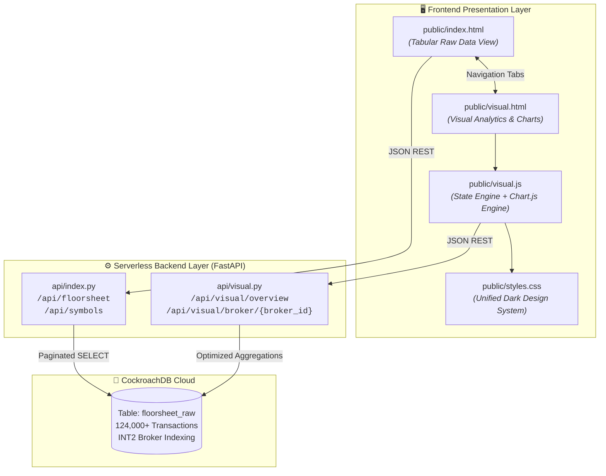

# 📊 Master Architectural Plan: NEPSE Floorsheet Broker Visual Analytics Suite

**Document**: `Visualplan.md`  
**Status**: 📋 Final Architecture (Reviewed & Synthesized)  
**Authors**: Jagdish Sah & Your Zara  

---

## 🌟 1. Executive Summary & Core Objective

The **NEPSE Broker Visual Analytics Suite** (`public/visual.html` + `api/visual.py`) transforms raw, noisy transaction feeds into institutional-grade transaction-flow intelligence for the Nepal Stock Exchange.

### Core Analytical Principles
1. **Observed Flow Truth (Not Hypothetical Holdings)**:
   - Floorsheet data captures *intra-day transaction flow*, not historical portfolios or total inventory.
   - All net metrics are strictly formulated as **Net Flow Volume (`Buy Qty - Sell Qty`)** and **Net Flow Value (`Buy Amount - Sell Amount`)**.
   - Terminology uses **Net Bought (Accumulation)** and **Net Sold (Distribution)** rather than "Holdings" or "Profits".
2. **Gross Activity vs. Market Turnover**:
   - **Market Turnover**: `SUM(amount)` across distinct trades.
   - **Broker Gross Activity**: `Buy Amount + Sell Amount` for that specific broker.
   - **Broker Market Share %**: `(Broker Gross Activity / (2 * Market Turnover)) * 100`.
3. **Multi-Dimensional Metrics**:
   - Top scrips are evaluated separately by **Volume (Quantity)** and **Turnover Value (NPR Amount)**.
   - Counterparty flow displays exact denominators (e.g. `35.2% of Broker #58 Buy Value`).
4. **Clean Decoupled Architecture**:
   - `api/visual.py` (FastAPI): Highly optimized single-pass SQL aggregations for CockroachDB.
   - `public/visual.html` + `public/visual.js`: Interactive dark-themed UI (TradingView design system + Chart.js).
   - `public/index.html`: Linked via an intuitive top navigation tab bar.

---

## 🔍 2. Verified Production Database Environment

The underlying CockroachDB cluster (`nepse-floorsheet-33034`) schema has been directly inspected and verified:

```sql
CREATE TABLE public.floorsheet_raw (
    contract_id    BIGINT PRIMARY KEY,
    symbol         VARCHAR(20) NOT NULL,
    buyer_broker   SMALLINT NOT NULL,      -- INT2 (1 to 101)
    seller_broker  SMALLINT NOT NULL,      -- INT2 (1 to 101)
    quantity       BIGINT NOT NULL,
    rate           DECIMAL(10,2) NOT NULL,
    amount         DECIMAL(15,2) NOT NULL,
    trade_time     TIMESTAMPTZ NOT NULL,
    CONSTRAINT chk_positive_values CHECK (quantity > 0 AND rate > 0 AND amount > 0)
) WITH (schema_locked = true);

-- Verified High-Performance Composite Indexes:
-- 1. idx_buyer_time  ON floorsheet_raw (buyer_broker ASC, trade_time ASC)
-- 2. idx_seller_time ON floorsheet_raw (seller_broker ASC, trade_time ASC)
-- 3. idx_symbol_time ON floorsheet_raw (symbol ASC, trade_time ASC)
```

---

## 🏛️ 3. System Architecture & Component Design



---

## ⚙️ 4. API Specification & SQL Aggregation Strategy (`api/visual.py`)

To ensure ultra-low latency and minimal serverless roundtrips, the backend is consolidated into **two high-efficiency endpoints**:

### Endpoint 1: `GET /api/visual/overview`
Retrieves market-wide macro telemetry and the complete broker leaderboard matrix.

- **Query Parameters**:
  - `date`: `YYYY-MM-DD` (Required, e.g. `2026-08-31`)
  - `start_time`: `HH:MM:SS` (Optional, e.g. `11:00:00`)
  - `end_time`: `HH:MM:SS` (Optional, e.g. `15:00:00`)
  - `min_activity`: `float` (Optional minimum turnover threshold)

- **SQL Execution Strategy**:
  Single-pass aggregation using CTEs (Common Table Expressions) and window functions (`ROW_NUMBER() OVER (...)`) to compute Top Bought, Top Sold, Top Accumulation, and Top Distribution in a single database roundtrip:

```sql
WITH filtered_trades AS (
    SELECT contract_id, symbol, buyer_broker, seller_broker, quantity, rate, amount, trade_time
    FROM floorsheet_raw
    WHERE trade_time >= %s::timestamptz AND trade_time <= %s::timestamptz
),
broker_scrip_flows AS (
    SELECT 
        broker_id, symbol,
        SUM(buy_qty) AS buy_qty, SUM(sell_qty) AS sell_qty,
        SUM(buy_amt) AS buy_amt, SUM(sell_amt) AS sell_amt,
        (SUM(buy_qty) - SUM(sell_qty)) AS net_qty,
        (SUM(buy_amt) - SUM(sell_amt)) AS net_amt
    FROM (
        SELECT buyer_broker AS broker_id, symbol, quantity AS buy_qty, 0::bigint AS sell_qty, amount AS buy_amt, 0::numeric AS sell_amt FROM filtered_trades
        UNION ALL
        SELECT seller_broker AS broker_id, symbol, 0::bigint AS buy_qty, quantity AS sell_qty, 0::numeric AS buy_amt, amount AS sell_amt FROM filtered_trades
    ) combined
    GROUP BY broker_id, symbol
),
broker_totals AS (
    SELECT 
        broker_id,
        SUM(buy_amt) AS total_buy_val,
        SUM(sell_amt) AS total_sell_val,
        (SUM(buy_amt) + SUM(sell_amt)) AS gross_activity,
        (SUM(buy_amt) - SUM(sell_amt)) AS net_flow_val,
        SUM(buy_qty) AS total_buy_qty,
        SUM(sell_qty) AS total_sell_qty,
        (SUM(buy_qty) - SUM(sell_qty)) AS net_flow_qty
    FROM broker_scrip_flows
    GROUP BY broker_id
),
ranked_scrips AS (
    SELECT *,
        ROW_NUMBER() OVER (PARTITION BY broker_id ORDER BY buy_amt DESC) AS rank_top_buy_val,
        ROW_NUMBER() OVER (PARTITION BY broker_id ORDER BY sell_amt DESC) AS rank_top_sell_val,
        ROW_NUMBER() OVER (PARTITION BY broker_id ORDER BY net_amt DESC) AS rank_top_accum_val,
        ROW_NUMBER() OVER (PARTITION BY broker_id ORDER BY net_amt ASC) AS rank_top_dist_val
    FROM broker_scrip_flows
)
-- Combine totals with top-ranked scrips
SELECT ...
```

- **Response Payload**:
```json
{
  "date": "2026-08-31",
  "time_window": { "start": "11:00:00", "end": "15:00:00" },
  "market_summary": {
    "total_market_turnover": 3648609878.00,
    "total_market_shares": 9322185,
    "total_market_trades": 68137,
    "active_brokers_count": 62,
    "active_scrips_count": 318
  },
  "brokers": [
    {
      "broker_id": 58,
      "buy_value": 284500120.00,
      "sell_value": 195200340.00,
      "gross_activity": 479700460.00,
      "net_flow_value": 89299780.00,
      "net_flow_pct": 18.62,
      "buy_sell_ratio": 1.46,
      "buy_qty": 450200,
      "sell_qty": 310100,
      "net_flow_qty": 140100,
      "market_share_pct": 6.57,
      "top_bought": { "symbol": "SHIVM", "quantity": 120000, "value": 62400000.00 },
      "top_sold": { "symbol": "NABIL", "quantity": 85000, "value": 42500000.00 },
      "top_accumulation": { "symbol": "SHIVM", "net_qty": 95000, "net_value": 49400000.00 },
      "top_distribution": { "symbol": "NABIL", "net_qty": -60000, "net_value": -30000000.00 }
    }
  ]
}
```

---

### Endpoint 2: `GET /api/visual/broker/{broker_id}`
Provides the deep-dive intelligence for a single broker: portfolio scrip breakdown, intraday velocity chart timeline, and counterparty network.

- **Query Parameters**:
  - `date`: `YYYY-MM-DD` (Required)
  - `start_time`: `HH:MM:SS` (Optional)
  - `end_time`: `HH:MM:SS` (Optional)
  - `bucket`: `5m` | `15m` | `30m` | `1h` (Default: `15m`)

- **Response Payload**:
```json
{
  "broker_id": 58,
  "date": "2026-08-31",
  "summary": {
    "buy_value": 284500120.00,
    "sell_value": 195200340.00,
    "gross_activity": 479700460.00,
    "net_flow_value": 89299780.00,
    "net_flow_pct": 18.62,
    "buy_sell_ratio": 1.46,
    "total_trades": 4120,
    "peak_trading_window": "13:30-13:45"
  },
  "scrips": [
    {
      "symbol": "SHIVM",
      "buy_qty": 120000,
      "sell_qty": 25000,
      "net_flow_qty": 95000,
      "buy_value": 62400000.00,
      "sell_value": 13000000.00,
      "net_flow_value": 49400000.00,
      "avg_buy_rate": 520.00,
      "avg_sell_rate": 520.00,
      "flow_status": "ACCUMULATING"
    }
  ],
  "timeline": [
    {
      "time_label": "11:00-11:15",
      "buy_value": 24000000.00,
      "sell_value": 10000000.00,
      "net_flow_value": 14000000.00,
      "trades_count": 310
    }
  ],
  "counterparties": {
    "bought_from": [
      {
        "counter_broker": 45,
        "value": 54000000.00,
        "quantity": 105000,
        "trades_count": 620,
        "buy_value_share_pct": 18.98,
        "top_symbol": "SHIVM"
      }
    ],
    "sold_to": [
      {
        "counter_broker": 34,
        "value": 41000000.00,
        "quantity": 80000,
        "trades_count": 480,
        "sell_value_share_pct": 21.00,
        "top_symbol": "NABIL"
      }
    ]
  }
}
```

---

## 💻 5. Frontend UI/UX Architecture (`public/visual.html`)

### Shared Navigation Bar
- Seamless switcher between **[ 📄 Raw Floorsheet ]** and **[ 📈 Broker Analytics ]**.

### View Structure
1. **Header Filter Control Panel**:
   - Date Picker (`filterDate`).
   - Quick Intraday Time Chips: `[Full Session (11:00-15:00)]`, `[Opening 11-12]`, `[Mid-Day 12-14]`, `[Closing 14-15]`, and Custom `[Start Time]` / `[End Time]`.
   - Broker Quick Filter Dropdown.
2. **Market Overview KPI Cards**:
   - `Market Turnover` | `Active Brokers` | `Top Accumulator Broker` | `Top Distributor Broker`
3. **Master Broker Leaderboard**:
   - Sortable Columns: Broker ID, Gross Activity, Buy Value, Sell Value, Net Flow Value, Net Flow %, Buy/Sell Ratio, Top Bought, Top Sold, Top Accumulation, Top Distribution.
   - Clickable row / `[🔍 Deep Dive]` button triggering the dedicated Broker Detail View.
4. **Deep Broker Detail View (Interactive Drawer / Panel)**:
   - **Broker KPI Banner**: Gross activity, Net flow, Buy/Sell ratio.
   - **Intraday Flow Chart (Chart.js)**: Configurable time buckets (`5m`, `15m`, `30m`, `1h`) showing Buy vs Sell vs Net Flow over session time.
   - **Scrip Breakdown Table**: Complete scrips traded with quantity, amount, average price, and flow badges (`🟢 ACCUMULATING` vs `🔴 DISTRIBUTING`).
   - **Counterparty Matrix**: Side-by-side cards for *Top Counterparties Bought From* and *Top Counterparties Sold To* with explicit percentage shares.

---

## 🛠️ 6. Implementation Plan & Deliverables

| Phase | Milestone | Files Involved |
|---|---|---|
| **Phase 1** | **Backend Analytics Engine**<br/>• Build `api/visual.py` with FastAPI endpoints.<br/>• Implement single-pass CockroachDB aggregation CTEs.<br/>• Update `vercel.json` routing. | [`api/visual.py`](../../api/visual.py)<br/>[`vercel.json`](../../vercel.json) |
| **Phase 2** | **Frontend Layout & Navigation**<br/>• Create `public/visual.html` and `public/visual.js`.<br/>• Add top navigation tab switcher in `public/index.html`.<br/>• Load Chart.js via CDN. | [`public/visual.html`](../../public/visual.html)<br/>[`public/visual.js`](../../public/visual.js)<br/>[`public/index.html`](../../public/index.html) |
| **Phase 3** | **Broker Leaderboard & Matrix**<br/>• Render macro broker table with sortable columns.<br/>• Display Top Bought, Top Sold, Top Accumulation, Top Distribution. | `public/visual.js`<br/>`public/styles.css` |
| **Phase 4** | **Deep Broker Drilldown & Charts**<br/>• Build interactive Broker Drawer/Panel.<br/>• Render Intraday Timeline Area/Bar Chart with bucket selector (`5m`, `15m`, `30m`, `1h`).<br/>• Render Scrip Breakdown and Counterparty breakdown. | `public/visual.js`<br/>`public/styles.css` |
| **Phase 5** | **Verification & Cross-Validation**<br/>• Reconcile broker sums against raw floorsheet totals.<br/>• Test mobile/desktop responsiveness. | Automated test queries |

---

*This blueprint is verified, complete, and ready for execution upon your confirmation.*
